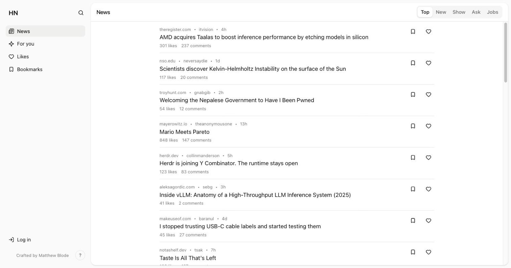

# [HN](https://blode.co/hn)

**A fast, keyboard-driven Hacker News client with an optional feed that learns what you read**

Browse the feeds, read and reply to threads, and sign in to vote and submit.

  

## Demo

Open the client and read Hacker News, no account needed.

## What you can do

- **Read every HN feed:** Top, New, Show HN, Ask HN, and Jobs, switchable from the feed tabs.
- **Open a story:** the article and the full comment thread, with the keyboard for moving between stories.
- **Turn on For you:** an optional personalized feed that reorders stories from your reading habits (dwell time, opens, votes) using an on-device model of time decay, topic and domain affinity, and diversity spacing.
- **Sign in with your HN account:** upvote, comment, and submit without leaving the app.
- **Like and bookmark:** save stories to read or revisit later.
- **Search:** full-text story search over the Algolia HN index, with recent-search history.

## Keyboard shortcuts

| Key | Action |
|-----|--------|
| `J` / `K` | Next or previous post |
| `O` | Open the link |
| `C` | Open on Hacker News |
| `L` / `B` | Like or bookmark the post |
| `R` | Reply to the post |
| `1` to `5` | Top, New, Show, Ask, Jobs |
| `G` then `H` / `N` / `L` / `B` | Home, News, Likes, Bookmarks |
| `/` | Open search |
| `Cmd+K` | Command menu |
| `Cmd+/` | Show all shortcuts |
| `Cmd+B` | Toggle the sidebar |
| `Esc` | Go back |

## Private by default

Your reading history, likes, bookmarks, and the personalization model live in the browser (IndexedDB) and never leave the device. Story data comes from the public Hacker News APIs.

## License

MIT

---

Crafted by  [Matthew Blode](https://blode.co)
